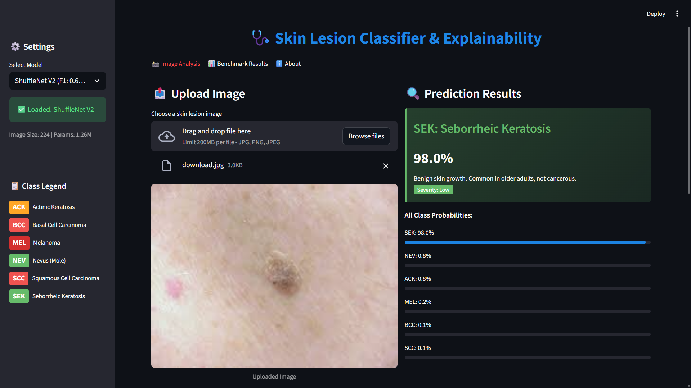
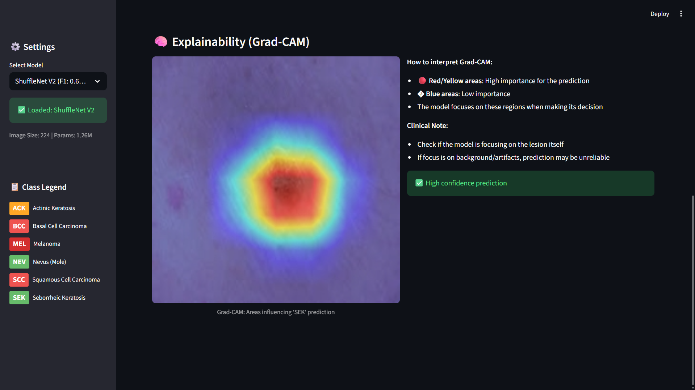
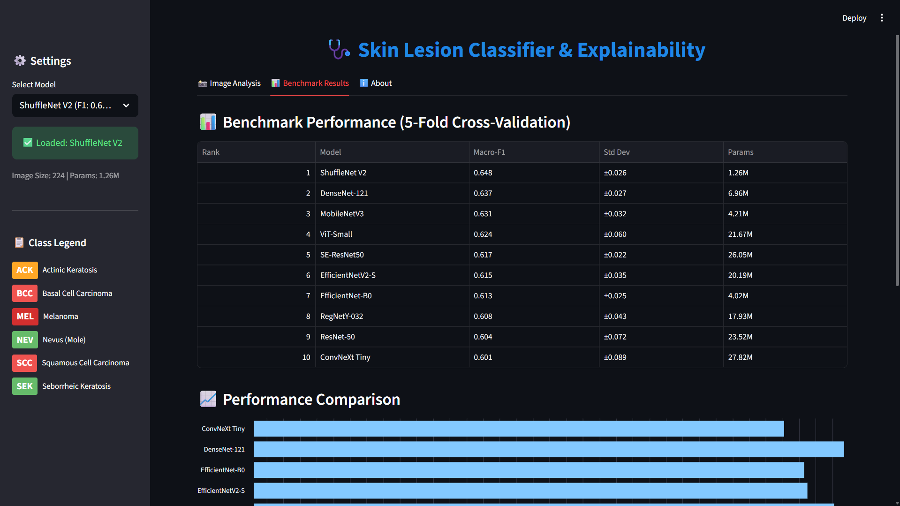

# Skin Lesion Classification Benchmark (PyTorch)


## 📌 Project Overview

This project is an **End-to-End Deep Learning Benchmark** for **skin lesion classification** using the **PAD-UFES-20** dataset. The primary goal is to establish a **fair, reproducible, and production-ready pipeline** for comparing modern CNN and Transformer architectures.

Key features include:
1.  **Scientific Benchmarking**: Apples-to-apples comparison of 10 backbone architectures using identical training hyperparameters and data splits.
2.  **Cross-Validation**: 5-fold patient-level CV with statistical analysis for rigorous evaluation.
3.  **Robust Engineering**: Modular, config-driven codebase designed for scalability.
4.  **Production Readiness**: Integration with **ONNX Runtime** for deployment and **Streamlit** for interactive demonstration.
5.  **Model Interpretability**: Implementation of **Grad-CAM** to visually audit model focus areas.

---

## 📊 Benchmark Results

### Top Performers (5-Fold Cross-Validation)

| Rank | Backbone | Macro-F1 | Balanced Acc | Params (M) | Latency (ms) |
|:----:|----------|:--------:|:------------:|:----------:|:------------:|
| 🥇 | **ShuffleNet V2** | 0.613 ± 0.026 | 0.616 ± 0.038 | **1.26** | 52.8 |
| 🥈 | ViT-Small | 0.607 ± 0.027 | 0.605 ± 0.015 | 21.67 | 61.3 |
| 🥉 | DenseNet-121 | 0.604 ± 0.032 | 0.594 ± 0.028 | 6.96 | 52.7 |
| 4 | SE-ResNet50 | 0.594 ± 0.035 | 0.583 ± 0.032 | 26.05 | 49.6 |
| 5 | EfficientNetV2-S | 0.582 ± 0.025 | 0.574 ± 0.021 | 20.19 | 51.2 |
| 6 | ResNet-50 | 0.579 ± 0.022 | 0.586 ± 0.029 | 23.52 | 51.0 |
| 7 | RegNetY-032 | 0.576 ± 0.043 | 0.599 ± 0.048 | 17.93 | 55.4 |
| 8 | MobileNetV3 | 0.569 ± 0.060 | 0.559 ± 0.068 | 4.21 | 54.5 |
| 9 | ConvNeXt Tiny | 0.539 ± 0.072 | 0.548 ± 0.077 | 27.82 | 47.1 |
| 10 | EfficientNet-B0 | 0.504 ± 0.089 | 0.505 ± 0.067 | 4.02 | 54.3 |

### Key Insights

🔥 **Surprising Finding**: ShuffleNet V2 (ultra-lightweight, 1.26M params) achieves the **best performance**, outperforming heavier models like ViT and SE-ResNet50. This suggests that for this dataset size (~2,300 images), simpler architectures generalize better.

⚠️ **Challenge**: All models struggle with **SCC (Squamous Cell Carcinoma)** class, with recall ranging from 19-30%. This indicates a need for specialized handling of rare, critical classes.

📈 **Transformer Performance**: ViT-Small ranks #2, demonstrating that Vision Transformers can compete with CNNs even on smaller medical datasets when properly fine-tuned.

---

## 📸 Screenshots

### Main Interface - Classification


*Upload skin lesion images and get instant predictions with confidence scores*

### Grad-CAM Explainability


*Visualize which regions the model focuses on for its prediction*

### Benchmark Results


*Compare performance across 10 different CNN/Transformer architectures*

---

## 📦 Dataset: PAD-UFES-20

The benchmark utilizes the **PAD-UFES-20** dataset, a public skin lesion dataset containing clinical images collected from smartphone devices.

**📥 Download Links:**
- **Original (Mendeley):** [https://data.mendeley.com/datasets/zr7vgbcyr2/1](https://data.mendeley.com/datasets/zr7vgbcyr2/1)
- **Kaggle Mirror:** [https://www.kaggle.com/datasets/mahdavi1202/skin-cancer](https://www.kaggle.com/datasets/mahdavi1202/skin-cancer)

**Classes (6 categories):**
1.  **ACK**: Actinic Keratosis
2.  **BCC**: Basal Cell Carcinoma
3.  **MEL**: Melanoma (Critical class: most deadly skin cancer)
4.  **NEV**: Nevus (Benign mole)
5.  **SCC**: Squamous Cell Carcinoma
6.  **SEK**: Seborrheic Keratosis

**Data Structure & Splitting Strategy:**
- Images are stored in `data/images/`.
- Metadata is managed via `data/metadata.csv`.
- **Critical Fairness Note**: Data splitting is performed at the **Patient ID** level (not Image ID). Since one patient often provides multiple images of the same lesion, patient-level splitting is mandatory to prevent **data leakage** and ensure unbiased evaluation.

---

## 🧠 Benchmarked Backbones

This project evaluates a diverse set of architectures, ranging from lightweight mobile models to Vision Transformers. The backbone implementations rely on `torchvision` and `timm`.

**Key Models:**
1.  **ResNet-50** (*torchvision*): The standard industry baseline.
2.  **DenseNet-121** (*torchvision*): Feature reuse via dense connections.
3.  **EfficientNet-B0** (*timm*): Balanced efficiency and accuracy.
4.  **ConvNeXt Tiny** (*timm*): Modern "ConvNet for the 2020s" design.
5.  **EfficientNetV2-S** (*timm*): Faster training speed and parameter efficiency.
6.  **SE-ResNet50** (*timm*): ResNet-50 with Squeeze-and-Excitation attention.
7.  **ViT Small (Patch 16)** (*timm*): Pure Vision Transformer baseline.
8.  **RegNetY-032** (*timm*): Optimized network design space.
9.  **MobileNetV3 Large** (*torchvision*): Optimized for mobile/edge inference.
10. **ShuffleNet V2 x1.0** (*torchvision*): Extremely lightweight computation.

*(Backbones are configured in `configs/backbones.yaml`)*

---

## 🛠️ Technical Architecture

### 1. Codebase Modules (`src/`)

#### 🏗️ Core Training & Modeling
- **`train.py`**: The central training loop. It handles:
  - **Mixed Precision (AMP)**: Optimizes GPU usage.
  - **Gradient Scaling**: Prevents underflow during FP16 training.
  - **Two-Stage Fine-Tuning**: Orchestrates the freeze/unfreeze schedule for transfer learning.
  - **Checkpointing**: Logic to save the best model based on validation Macro-F1.
  - **Cross-Validation Support**: `--cv_fold` argument for K-fold training.
- **`model.py`**: Abstract model builder.
  - Serves as a unified interface for **torchvision** and **timm** models.
  - Handles replacing the classifier head dynamically for 6-class output.
  - Provides utilities for `freeze_backbone()` vs `unfreeze_all()`.

#### 💿 Data Handling
- **`dataset.py`**:
  - **`PADUfesDataset`**: Custom Dataset class that handles image loading and metadata mapping.
  - **`build_transforms`**: Configurable **Albumentations** pipeline. Implements heavy augmentations (Rotate, Flip, GaussianNoise, ColorJitter) for training and deterministic resizing for validation.
  - **`WeightedRandomSampler`**: Calculates inverse-frequency weights to oversample minority classes (MEL, BCC) during training batch construction.
  - **CV Splits Support**: Auto-detects single vs. K-fold split format.

#### 📊 Evaluation & Metrics
- **`eval.py`**: Standalone inference script.
  - Loads a trained checkpoint and runs inference on the Test set.
  - Measures **Inference Latency** (ms/sample).
- **`metrics.py`**: Centralized metric calculation.
  - Computes **Macro-F1**, **Balanced Accuracy**, and **Per-Class Recall**.
  - Generates the Confusion Matrix.
- **`gradcam.py`**: Interpretability module.
  - Wraps the model to extract gradients from the final convolutional layer.
  - Auto-detects target layers for common backbones (ResNet, EfficientNet, ConvNeXt).

#### 🛠️ Utilities
- **`utils.py`**:
  - **Reproducibility**: `set_seed()` ensures deterministic runs across numpy, torch, and random.
  - **Logging**: Helpers for JSON serialization and directory management.

### 2. Automation Scripts (`scripts/`)

These scripts automate the benchmark workflow:

#### 📁 Data Management
- **`generate_splits.py`**: Generates patient-level data splits.
  - Single split: `--mode single` → `splits.json`
  - Cross-validation: `--mode cv --k_folds 5` → `cv_splits.json`

#### 🤖 Benchmark Automation
- **`run_cv_benchmark.py`**: Runs full cross-validation training.
  - Trains all 10 backbones × 5 folds automatically.
  - Supports `--resume` to continue interrupted runs.
  - Selective training: `--backbones resnet50 densenet121`
- **`eval_cv_all.py`**: Evaluates all trained checkpoints.
  - Computes test metrics for each fold.
  - Supports `--skip_existing` to avoid re-evaluation.

#### 📊 Analysis & Reporting
- **`aggregate_results.py`**: Aggregates CV results into summary statistics.
  - Computes mean, std, 95% CI across folds.
  - Outputs `cv_report.csv` for the leaderboard.
- **`statistical_analysis.py`**: Performs statistical significance tests.
  - Paired t-tests between top backbones.

#### 📦 Deployment
- **`export_onnx.py`**: Exports trained models to ONNX format for production.

## 🏗️ Project Structure

```bash
skin-backbone-benchmark/
├── app.py                      # 🖥️ Streamlit Dashboard
├── configs/
│   ├── config.yaml             # ⚙️ Master configuration
│   └── backbones.yaml          # List of benchmarked architectures
├── data/
│   ├── images/                 # Raw images
│   ├── metadata.csv            # Labels & Patient IDs
│   ├── splits.json             # Single train/val/test split
│   └── cv_splits.json          # 5-fold CV splits
├── scripts/
│   ├── generate_splits.py      # � Split generation (single or CV)
│   ├── aggregate_results.py    # 📊 Results aggregation
│   ├── statistical_analysis.py # 📈 Statistical comparison
│   ├── run_cv_benchmark.py     # 🤖 Automated CV training
│   ├── eval_cv_all.py          # 🤖 Automated CV evaluation
│   └── export_onnx.py          # 📦 ONNX Export Script
├── src/
│   ├── dataset.py              # Dataloader & Augmentations
│   ├── model.py                # Model Factory
│   ├── train.py                # 🔥 Training Loop
│   ├── eval.py                 # Evaluation Script
│   ├── metrics.py              # Metrics calculation
│   ├── gradcam.py              # 🧠 Explainability Module
│   └── utils.py                # Utility functions
├── outputs/
│   ├── runs/                   # Training checkpoints & metrics
│   └── cv_report.csv           # Aggregated CV results
├── notebooks/
│   └── skin_lesion_classifier_pipeline.ipynb  # 📓 Demo Notebook
└── requirements.txt
```

### 📓 Demo Notebook

The `notebooks/skin_lesion_classifier_pipeline.ipynb` is a **Kaggle/Colab-ready** notebook that demonstrates the complete pipeline:

- ✅ **Single backbone training** for quick demonstration (~1-2 hours)
- ✅ **All hyperparameters** configurable at the top
- ✅ **Pre-computed benchmark results** from full 5-fold CV
- ✅ **Grad-CAM visualization** without external dependencies
- ✅ **Auto-downloads dataset** from Kaggle

**Run on Kaggle:**
1. Upload notebook to Kaggle
2. Click "Add Input" → Search `mahdavi1202/skin-cancer`
3. Run all cells!

---

## 💻 Quick Start Guide

### Prerequisites
- Python 3.10+
- CUDA-capable GPU (Recommended)

### 1. Installation
```bash
# Clone & install dependencies
git clone https://github.com/muhwira27/skin-lesion-cnn-benchmark.git
cd skin-lesion-cnn-benchmark
pip install -r requirements.txt
```

### 2. Data Preparation
Ensure images are in `data/images/` and metadata in `data/metadata.csv`.
```bash
# Generate 5-fold CV splits (recommended)
python scripts/generate_splits.py --mode cv --n_folds 5

# Or generate single split
python scripts/generate_splits.py --mode single
```

### 3. Training

**Option A: Train single backbone**
```bash
python src/train.py --backbone resnet50 --cv_fold 0
```

**Option B: Train all backbones (CV benchmark)**
```bash
# Train specific backbones
python scripts/run_cv_benchmark.py --backbones resnet50 densenet121

# Train all backbones (full benchmark)
python scripts/run_cv_benchmark.py

# Resume interrupted training
python scripts/run_cv_benchmark.py --resume
```

### 4. Evaluation & Aggregation
```bash
# Evaluate all CV runs
python scripts/eval_cv_all.py

# Aggregate results
python scripts/aggregate_results.py --runs_dir outputs/runs --out outputs/cv_report.csv --verbose

# Statistical comparison between backbones
python scripts/statistical_analysis.py --backbone1 shufflenet_v2_x1_0 --backbone2 resnet50 --metric macro_f1
```

### 5. Interactive Demo
Launch the local dashboard.
```bash
streamlit run app.py
```

### 6. Deployment Export
Convert the best model to ONNX.
```bash
python scripts/export_onnx.py --ckpt outputs/runs/resnet50_.../best.ckpt --check
```

---

## 🔬 Methodology

### Cross-Validation Protocol
- **5-fold stratified CV** at patient level
- Each fold: ~70% train, 15% validation, 15% test
- Results reported as **mean ± std** across folds
- 95% confidence intervals computed via bootstrap

### Training Configuration
- **Optimizer**: AdamW (weight_decay=0.01)
- **Scheduler**: Cosine annealing with warmup
- **Two-stage fine-tuning**: 8 epochs frozen backbone + 25 epochs full training
- **Imbalance handling**: Weighted random sampling
- **Early stopping**: Patience=8 on validation Macro-F1

### Evaluation Metrics
- **Primary**: Macro-F1 (handles class imbalance)
- **Secondary**: Balanced Accuracy, Per-class Recall
- **Clinical Focus**: MEL and SCC recall (critical cancer classes)

---

## 👤 Author

**Muh. Wira Ramdhani Fadhil**  
*AI/ML Engineer & Computer Vision Enthusiast*

---

## 📄 License

This project is licensed under the **MIT License** - see the [LICENSE](LICENSE) file for details.
